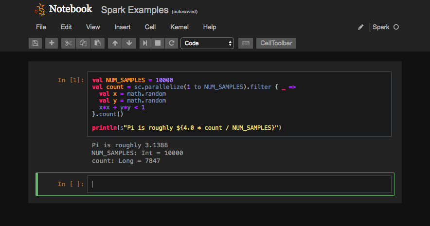
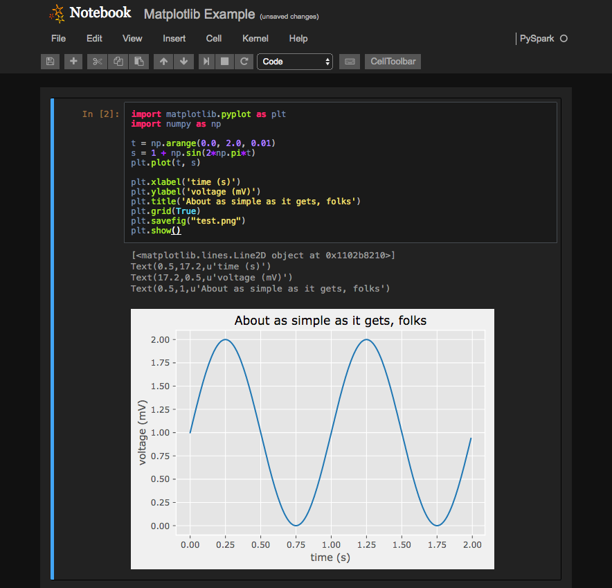
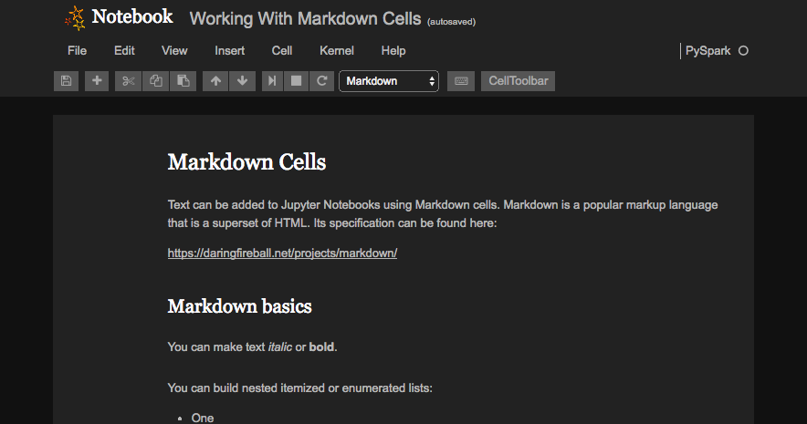

# Sparkling-Notebook
Yet another notebook application which is designed to work with Apache Spark. Sparkling-Notebook is basically a clone of Jupyter with slight behavior difference. Supported languages are only Scara and Python.

## Why creating another Notebook ?
There are already good notebook solutions for Apache Spark, for example, [Apache Zeppelin](https://zeppelin.apache.org) is a very popular one, it has a lot of features and its community is very active. However I feel it's a little bit heavy weight and I tend to go with spark-shell which is not user friendly.

For those people who use Jupyter may want to consider [Apache Toree](https://toree.apache.org/) which works inside Jupyter and brings in the support for Spark. However due to Jupyter's kernel behavior, it tries to create a Spark context in each notebook and that causes several problems such as memory pressure and high latency for load time.

There's another one I tried which is [Spark Notebook](http://spark-notebook.io/), it's a lightweight solution and it comes with lots of third party libraries such as d3 and bokeh. However I couldn't figure out how to use those but it does not support Python.

The approach Spark Notebook did is quite interesting, it's actually came from [Scala Notebook](https://github.com/Bridgewater/scala-notebook) which is basically a iPython clone. It uses all of good javascript which iPython has and replaced the server side with Play Framework. So I did the same, I created a server which works with Jupyter's javascript and it does what exactly I want it to do.

## Features
 * **Jupyter's Javascript**, Sparkling-Notebook uses the exact same javascript as Jupyter, so user experience is almost same, you can use jupyter's keyboard shortcuts !

 * **Single Spark Context**, single JVM and single Python. Notebooks share the same kernel so notebooks DO share sparkContext and variables.

 * **Dark themed**, Jupyter's default theme is too bright and bad for your eyes at night.

 * **Very lightweight**, As of now (10/28/2017), I have only 12 scala files to do this, this can't be heavy weight. I love this open source age.

 * **Python Supported**, yes I do python occasionally and of course, matplotlib inline chart is supported.

## How to Try
If you have sbt, this should work

```
git clone https://github.com/taroplus/sparkling-notebook.git
cd sparkling-notebook
export SPARK_HOME=/some/spark/home
sbt run
```
then hit http://localhost:9000

## Screenshots




## What is coming ..
 * Spark Streaming support
 * Code completion
 * Spark progress bar